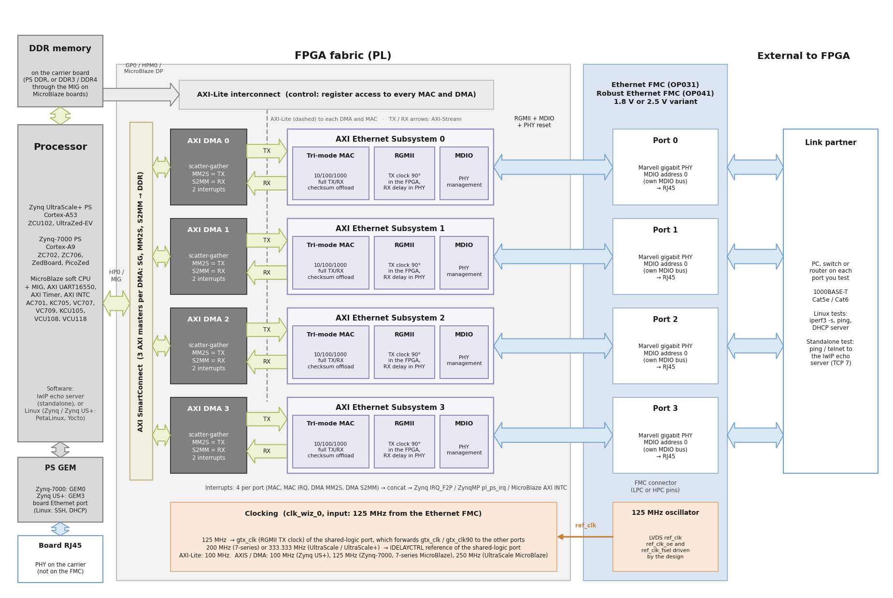
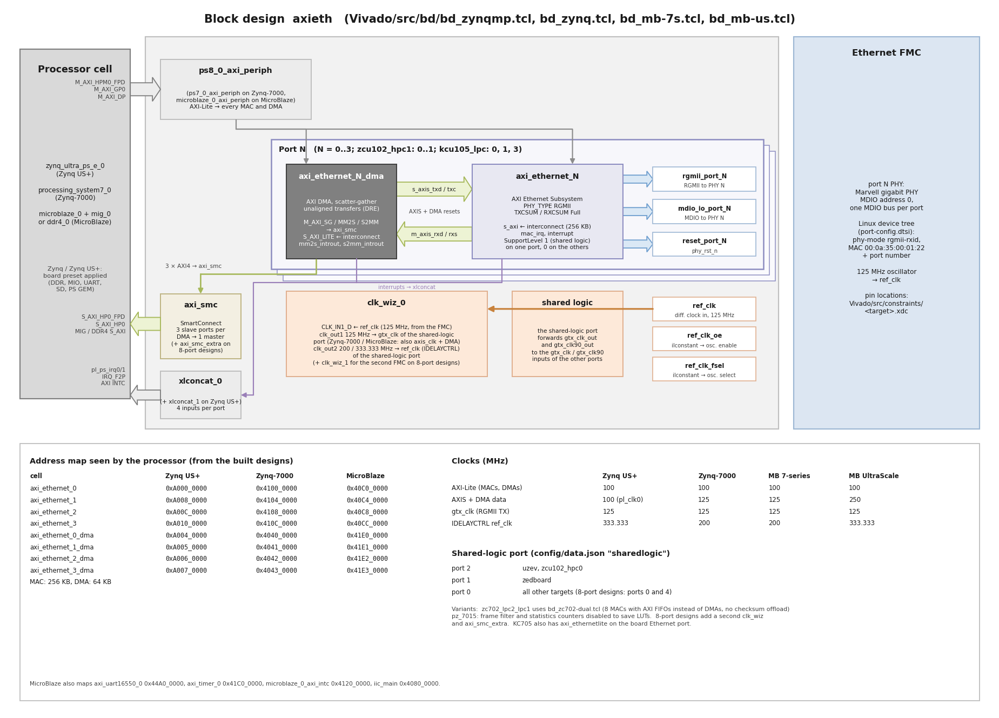

# Description

In this reference design, each port of the [Ethernet FMC] (or [Robust Ethernet FMC]) is connected
to its own AXI Ethernet Subsystem IP, which is connected to the system memory through its own AXI DMA
IP. The four ports are completely independent of each other: each one has its own MAC, its own DMA,
its own MDIO bus and its own PHY.



## How the design works

For each port of the Ethernet FMC:

* **PHY (on the FMC).** A Marvell gigabit Ethernet PHY drives the RJ45 connector. It connects to
  the FPGA over the FMC connector with an RGMII data interface, an MDIO management interface and a
  reset line. Every PHY sits on its own MDIO bus at MDIO address 0.
* **AXI Ethernet Subsystem.** A tri-mode (10/100/1000 Mbit/s) Ethernet MAC with an RGMII interface
  and an MDIO master. The MACs are configured with **full TX and RX checksum offload**: the hardware
  computes and checks the IP/TCP/UDP checksums. On the RGMII interface the FPGA shifts the transmit
  clock by 90 degrees (`gtx_clk90`), and the PHY adds the delay to the receive clock (Linux
  `phy-mode` `rgmii-rxid`).
* **AXI DMA.** A scatter-gather DMA moves the frames between the MAC's AXI-Stream interfaces and
  memory: MM2S (memory to stream) for transmit, S2MM (stream to memory) for receive. Its three AXI
  master interfaces (scatter-gather, MM2S, S2MM) reach the DDR through an AXI SmartConnect and the
  processor's high-performance slave port (Zynq HP0) or the memory controller (MicroBlaze designs).
* **Control.** The processor accesses the registers of every MAC and DMA through an AXI-Lite
  interconnect. Each port contributes four interrupts (two from the MAC, two from the DMA).

Shared by all ports:

* **Clocking.** The Ethernet FMC carries a 125 MHz oscillator. The design enables it and feeds it to
  a clock wizard, which generates the 125 MHz RGMII transmit clock and the reference clock for the
  IDELAY controller (200 MHz on 7-series devices, 333.333 MHz on UltraScale and UltraScale+
  devices). One port is configured with *shared logic*: it contains the clock buffers and IDELAY
  controller and forwards the transmit clocks (`gtx_clk`, `gtx_clk90`) to the other ports.
* **Board Ethernet port.** On the Zynq-7000 and Zynq UltraScale+ boards the carrier's own Ethernet
  port (PS GEM0 on Zynq-7000, PS GEM3 on Zynq UltraScale+) is enabled and described in the Linux
  device tree. It is not part of the FMC test, but it gives you a network connection to the board
  (for example SSH) that is independent of the ports under test.

### Processor families

The repository supports three families of carrier. The port chains are the same in all of them; the
processor side differs:

| Family | Boards | Processor | Software |
|--------|--------|-----------|----------|
| Zynq UltraScale+ | ZCU102, UltraZed-EV | Zynq UltraScale+ PS (Cortex-A53) | Standalone echo server, PetaLinux, Yocto |
| Zynq-7000 | ZC702, ZC706, ZedBoard, PicoZed | Zynq-7000 PS (Cortex-A9) | Standalone echo server, PetaLinux, Yocto |
| FPGA (MicroBlaze) | AC701, KC705, VC707, VC709, KCU105, VCU108, VCU118 | MicroBlaze soft processor with a MIG (DDR3 / DDR4) memory controller, AXI UART16550, AXI Timer and AXI interrupt controller | Standalone echo server |

The 8-port `zc702_lpc2_lpc1` design is a special case: the ZC702's device does not have enough
resources for 8 MACs with DMAs, so its MACs use AXI FIFOs instead of DMAs and have no checksum
offload. See [Supported carriers](supported_carriers.md#using-2x-ethernet-fmcs-for-8-ports).

## Block design

The diagram below shows the Vivado block design `axieth` as the scripts in `Vivado/src/bd/` build
it, with the real cell names, the address map and the clock frequencies of the built designs. One
port chain is drawn; the other ports are identical copies.



The diagrams are generated by the scripts `docs/source/images/gen_block_diagram.py` and
`docs/source/images/gen_bd_diagram.py` (Python 3 with matplotlib).

### MAC addresses used by Linux

The PetaLinux and Yocto images give the Ethernet FMC ports fixed MAC addresses (set in the
`port-config.dtsi` device-tree fragment of each BSP):

| Ethernet FMC port | MAC address |
|-------------------|-------------|
| Port 0 | `00:0a:35:00:01:22` |
| Port 1 | `00:0a:35:00:01:23` |
| Port 2 | `00:0a:35:00:01:24` |
| Port 3 | `00:0a:35:00:01:25` |

```{note}
These addresses are the same on every board that runs these images. If you connect more than one
board to the same network, change the `local-mac-address` properties in
`PetaLinux/bsp/ports-*/…/port-config.dtsi` and `Yocto/bsp/port-configs/ports-*/…/port-config.dtsi`
so that every board has unique addresses. The same applies to the fixed MAC address that the
ZedBoard and ZCU102 BSPs give the board Ethernet port (`local-mac-address` in the board's
`system-user.dtsi`).
```

## Hardware Platforms

The hardware designs provided in this reference are based on Vivado and support a range of FPGA and MPSoC evaluation
boards. The repository contains all necessary scripts and code to build these designs for the supported platforms listed below:


    
    
        
            
        
    
    
### {{ group.name }} platforms

| Target board        | FMC Slot Used | Supported<br>Num. Ports   | Standalone<br> Echo Server | PetaLinux | Yocto |
|---------------------|---------------|---------|-----|-----|-----|
| [{{ design.board }}]({{ design.link }}) | {{ design.connector }} | {{ design.lanes | length }}x |  ✅  ❌  |  ✅  ❌  |  ✅  ❌  |




## Software

These reference designs can be driven by a standalone application or from embedded Linux, built
with either PetaLinux or the AMD Yocto / Embedded Development Framework (EDF) flow. The repository
includes all necessary scripts and code to build each of them. The table below outlines the
applications available in each environment:

| Environment      | Build flow | Available Applications  |
|------------------|------------|-------------------------|
| Standalone       | Vitis | lwIP Echo Server (see [Stand-alone lwIP Echo Server](echo_server)) |
| Linux            | PetaLinux (see [PetaLinux](petalinux)) | Built-in Linux commands<br>Additional tools: ethtool, phytool, iperf3, bridge-utils |
| Linux            | Yocto / EDF (see [Yocto](yocto)) | Built-in Linux commands<br>Additional tools: ethtool, phytool, iperf3, bridge-utils |

The PetaLinux flow is being retired: 2025.2 is the last tool version for which this repository
supports it. From the next tool version onward, Linux images are built with the Yocto / EDF flow
only.

[Ethernet FMC]: https://docs.opsero.com/op031/datasheet/overview/
[Robust Ethernet FMC]: https://docs.opsero.com/op041/datasheet/overview/
