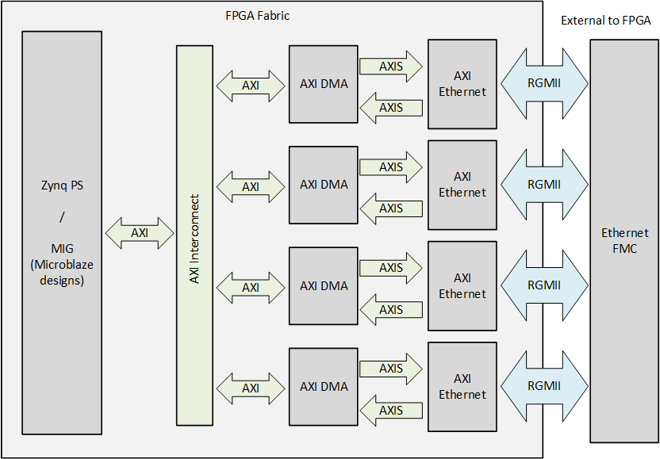

# Description

In this reference design, each port of the [Ethernet FMC] is connected to an AXI Ethernet Subsystem IP
which is connected to the system memory via an AXI DMA IP.

## Hardware Platforms

The hardware designs provided in this reference are based on Vivado and support a range of FPGA and MPSoC evaluation
boards. The repository contains all necessary scripts and code to build these designs for the supported platforms listed below:


    
    
        
            
        
    
    
### {{ group.name }} platforms

| Target board        | FMC Slot Used | Supported Num. Ports   | Standalone  Echo Server | PetaLinux |
|---------------------|---------------|---------|-----|-----|
| [{{ design.board }}]({{ design.link }}) | {{ design.connector }} | {{ design.lanes | length }}x |  ✅  ❌  |  ✅  ❌  |




## Software

These reference designs can be driven by either a standalone application or within a PetaLinux environment. 
The repository includes all necessary scripts and code to build both environments. The table 
below outlines the corresponding applications available in each environment:

| Environment      | Available Applications  |
|------------------|-------------------------|
| Standalone       | lwIP Echo Server |
| PetaLinux        | Built-in Linux commands Additional tools: ethtool, phytool, iperf3 |

[Ethernet FMC]: https://ethernetfmc.com/docs/ethernet-fmc/overview/
