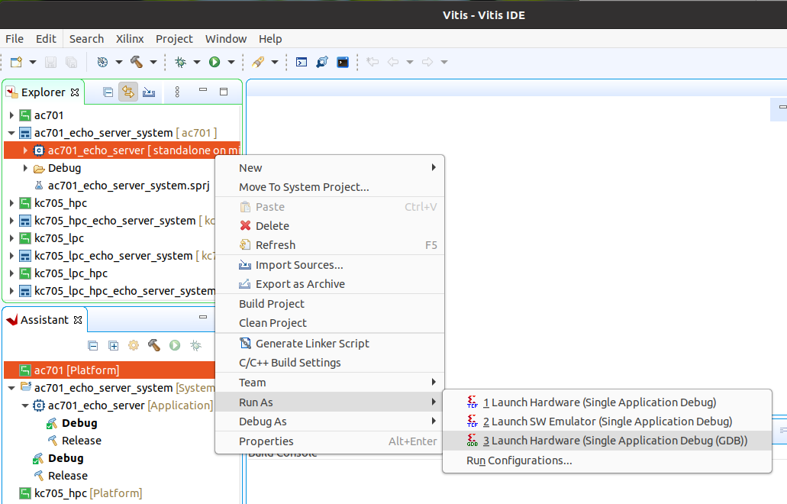

# Stand-alone lwIP Echo Server

The standalone (bare-metal) application is the lwIP TCP echo server that ships with Vitis as an
application template. It brings up one Ethernet FMC port, obtains an IP address by DHCP (or falls
back to a static address) and echoes back every byte it receives on TCP port 7. It is the quickest
way to check that the hardware works: no operating system, no SD card file system, and it runs on
every target in the repository, including the MicroBlaze (pure FPGA) boards that have no Linux flow.

Two modifications are applied on top of the Vitis template, both automatically by the build:

* **Modified lwIP library and AXI Ethernet driver.** The `EmbeddedSw` directory of the repository
  contains patched sources that the build copies into a local software repository of the Vitis
  workspace. The lwIP port adds the initialization of the Marvell PHYs of the Ethernet FMC
  (`xaxiemacif_physpeed.c`); the AXI Ethernet driver script is fixed for designs that use AXI FIFOs
  instead of DMAs (see `EmbeddedSw/README.md`).
* **Port selection.** On the Zynq-based boards the Vitis template would otherwise pick the PS GEM
  (the board's own Ethernet port) instead of the Ethernet FMC. A pre-build hook
  (`Vitis/py/pre_build.py`) replaces that selection with an `ETHERNET_PORT` define that selects the
  Ethernet FMC port (see [Change the target port](#change-the-target-port)). A second hook
  (`Vitis/py/pre_platform_build.py`) assigns the timer that lwIP needs for its DHCP and TCP timers.

## Building the application

Follow the [build instructions](build_instructions.md#build-vitis-workspace) — the steps are the
same on Windows and Linux:

```
./build.sh standalone --target <target>
```

This builds the Vivado project and XSA first if they do not exist yet, then:

1. Creates a Vitis workspace in `Vitis/<target>_workspace`.
2. Creates a local software repository (`embeddedsw`) inside the workspace with the patched lwIP
   library and AXI Ethernet driver from the `EmbeddedSw` directory of the repository.
3. Creates the platform from the XSA and the `echo_server` application from the lwIP echo server
   template, applies the hooks described above and builds it.
4. Packages the boot files into `Vitis/boot/<target>/`: `BOOT.BIN` for Zynq-7000 and Zynq
   UltraScale+ targets (FSBL, bitstream and application; ZynqMP also the PMU firmware), or the
   bitstream `axieth.bit` and `echo_server.elf` for MicroBlaze targets.

`./build.sh all --target <target>` (or `./build.sh package --target <target>`) also puts these files
into `bootimages/ethernet-fmc-axi-eth_<target>_standalone-2025-2.zip`.

## Set up the hardware

1. Connect the [Ethernet FMC] to the FMC connector used by your target design (see the target
   design tables in the [build instructions](build_instructions.md#target-designs)). Check that the
   card's I/O voltage variant (1.8 V or 2.5 V) is supported by your carrier and connector — see
   [Supported carriers](supported_carriers).
2. Connect the port that the application uses (Ethernet FMC port 0 by default) to a PC or to a
   network with a DHCP server, using a Cat5e or better cable.
3. Connect the board's USB-UART to your PC and open a terminal (see [UART settings](#uart-settings)).

## Run the application

### Zynq-7000 and Zynq UltraScale+: boot from SD card

1. Copy `BOOT.BIN` from `Vitis/boot/<target>/` (or from the standalone zip) to the first (FAT32)
   partition of an SD card. Nothing else is needed on the card.
2. Set the board to boot from SD card. The boot-mode switch settings are listed in
   [Boot PetaLinux](petalinux.md#boot-petalinux).
3. Insert the card and power up the board.

### All targets: run from the Vitis GUI over JTAG

```{tip}
You need to install the cable drivers before being able to boot via JTAG.
Note that the Vitis installer does not automatically install the cable drivers, it must be done separately.
For instructions, read section
[installing the cable drivers](https://docs.amd.com/r/en-US/ug973-vivado-release-notes-install-license/Installing-Cable-Drivers)
from the Vivado release notes.
```

1. Launch the Xilinx Vitis GUI.
2. When asked to select the workspace path, select the `Vitis/<target>_workspace` directory.
3. Power up your hardware platform and ensure that the JTAG is connected properly. On Zynq boards,
   set the boot-mode switches to JTAG (see [Boot via JTAG](petalinux.md#boot-via-jtag)).
4. In the Vitis Explorer panel, double-click on the System project that you want to run -
   this will reveal the application contained in the project. The System project will have
   the postfix "_system".
5. Now right click on the application "echo_server" then navigate the
   drop down menu to **Run As->Launch on Hardware (Single Application Debug (GDB)).**.



The run configuration will first program the FPGA with the bitstream, then load and run the
application.

### MicroBlaze targets: run from the command line over JTAG

With the bitstream and ELF from `Vitis/boot/<target>/` (or from the standalone zip), you can also
program the board from the XSDB console that ships with Vitis (`xsdb`):

```
connect
fpga axieth.bit
targets -set -filter {name =~ "MicroBlaze #0*"}
dow echo_server.elf
con
```

## What to expect

The UART output of the application should appear as follows (captured from a `pz_7030` boot —
ZynqMP targets prepend a Zynq MP First Stage Boot Loader banner):

```
-----lwIP TCP echo server ------
TCP packets sent to port 6001 will be echoed back
Start PHY autonegotiation 
Waiting for PHY to complete autonegotiation.
autonegotiation complete 
auto-negotiated link speed: 1000
Board IP: 192.168.2.72
Netmask : 255.255.255.0
Gateway : 192.168.2.1
TCP echo server started @ port 7
```

The above output results when the target port is connected to a router with DHCP. The assigned
board IP can vary. If DHCP fails the echo server falls back to a static IP — see
[IP address](#ip-address) below. (The template's banner mentions port 6001, but the server listens
on TCP port 7, as the last line says.)

## UART settings

To receive the UART output of this standalone application, you will need to connect the
USB-UART of the development board to your PC and run a console program such as 
[Putty]. The following UART settings must be used:

* Microblaze designs: 9600 baud
* Zynq and ZynqMP designs: 115200 baud

## IP address

By default, the echo server attempts to obtain an IP address from a DHCP server. This is useful
if the echo server is connected to a network. Once the IP address is obtained, it is printed out
in the UART console output.

If instead the echo server is connected directly to a PC, the DHCP attempt will fail and the echo
server's IP address will default to 192.168.1.10. To be able to communicate with the echo server
from the PC, the PC should be configured with a fixed IP address on the same subnet, for example:
192.168.1.20.

## Change the target port

The echo server example design can only target one Ethernet port at a time.
Selection of the Ethernet port can be changed by modifying the ``ETHERNET_PORT`` define
in the ``platform_config.h.in`` file located in the workspace application sources
(eg. ``Vitis/<target>_workspace/echo_server/src/platform_config.h.in``).
Set ``ETHERNET_PORT`` to one of the following values:

* ``0``: Ethernet FMC Port 0
* ``1``: Ethernet FMC Port 1
* ``2``: Ethernet FMC Port 2
* ``3``: Ethernet FMC Port 3

Then rebuild the application in the Vitis GUI. Running `./build.sh standalone --target <target>`
afterwards re-packages the boot file (`BOOT.BIN` or `echo_server.elf` in `Vitis/boot/<target>/`)
because the application ELF is now newer than it. On the `zcu102_hpc1` target only ports 0 and 1
exist, and on the `kcu105_lpc` target only ports 0, 1 and 3.

```{note}
The build runner does not recompile an existing workspace, and a new workspace (for example after
`./build.sh clean --target <target> --stage standalone`) is generated with `ETHERNET_PORT` set to 0
again. To change the default port for every new workspace, edit the `#define ETHERNET_PORT 0` line
in `Vitis/py/pre_build.py`.
```

## Example usage

### Ping the port

The echo server can be "pinged" from a connected PC, or if connected to a network, from
another device on the network. The UART console output will tell you what the IP address of the 
echo server is. To ping the echo server, use the `ping` command from a command console of a PC
that is connected to the echo server (either directly or via network).

Example command: `ping 192.168.1.10`

### Connect with telnet

We can also connect to the echo server using telnet and confirm that it is sending back (echoing) the data
that we are sending it. From the command prompt of a PC on the same network as the echo server, run the
following command:

Example command: `telnet 192.168.1.10 7`

The first argument of the telnet command specifies the IP address of the device to connect to (in our case
the echo server). The last argument in the command specifies the port number, which should be 7 for the 
echo server.

In the blank screen that opens after running the command, you can type letters and they will be sent to the 
echo server and be echoed back.

### Scripted echo test

To send more data than you can type, a few lines of Python on the PC do the same thing (replace the
IP address with the one printed by the echo server):

```python
import socket
s = socket.create_connection(("192.168.1.10", 7), timeout=5)
msg = bytes(range(256)) * 64          # 16 KiB test pattern
s.sendall(msg)
got = b""
while len(got) < len(msg):
    got += s.recv(65536)
print("echo OK" if got == msg else "echo MISMATCH")
s.close()
```

## Troubleshooting

* **No UART output at all.** Check the baud rate ([UART settings](#uart-settings)) and, on Zynq
  boards, the boot-mode switches.
* **Stuck at "Waiting for PHY to complete autonegotiation".** The selected port has no link: check
  the cable and link partner, and that `ETHERNET_PORT` selects the port you have connected. Check also
  that the Ethernet FMC is fully seated and that the carrier provides the I/O voltage (VADJ) of your
  card variant (1.8 V or 2.5 V).
* **Link comes up but DHCP fails and pings get no answer.** The echo server uses the static address
  192.168.1.10 when DHCP fails; give your PC an address on that subnet. If a direct connection with
  matching addresses still gets no answer, see [Troubleshooting](troubleshooting).

[Putty]: https://www.putty.org
[Ethernet FMC]: https://docs.opsero.com/op031/datasheet/overview/
