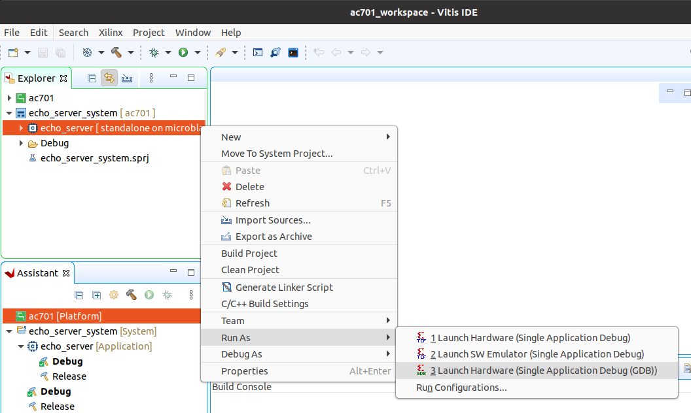

# Stand-alone lwIP Echo Server

These reference designs can be used with the stand-alone lwIP echo server application template that is 
part of Vitis; however, some modifications are required. The lwIP library needs some modifications to be able to 
properly configure the Marvell PHYs (88E1510) that are on the Ethernet FMC. The `Vitis` directory of the 
source repository contains a script that can be used to setup a Vitis workspace containing the echo server 
application and the modified lwIP library.

The build script does the following:

1. Creates a Vitis workspace in the `Vitis` directory of the source repository.
2. Creates a subdirectory called `embeddedsw` to be used as a local software repository
   containing the modified lwIP library.
3. Copies the sources from the `EmbeddedSw` directory of the repository to the local 
   software repository (`embeddedsw`), then copies any remaining/unmodified sources
   from the Vitis installation directory into the local software repository.
4. Generates a lwIP Echo Server example application for each exported Vivado design
   that is found in the `Vivado` directory. Most users will only have one exported
   Vivado design.

## Building the Vitis workspace

To build the Vitis workspace and example application, you must first generate
the Vivado project hardware design (the bitstream) and export the hardware.
Once the bitstream is generated and exported, then you can build the
Vitis workspace using the provided scripts. Follow the instructions appropriate for your
operating system:

* **Windows**: Follow the [build instructions for Windows users](/build_instructions.md#windows-users)
* **Linux**: Follow the [build instructions for Linux users](/build_instructions.md#linux-users)

## Run the application

You must follow the build instructions before you can run the application.

1. Launch the Xilinx Vitis GUI.
2. When asked to select the workspace path, select the `Vitis` directory of the project repository.
3. Power up your hardware platform and ensure that the JTAG is connected properly.
4. In the Vitis Explorer panel, double-click on the System project that you want to run -
   this will reveal the application contained in the project. The System project will have 
   the postfix "_system".
5. Now right click on the application (it should have the postfix "_echo_server") then navigate the
   drop down menu to **Run As->Launch on Hardware (Single Application Debug (GDB)).**.



The run configuration will first program the FPGA with the bitstream, then load and run the 
application. You can view the UART output of the application in a console window and it should
appear as follows:

```
-----lwIP TCP echo server ------
TCP packets sent to port 6001 will be echoed back
Start PHY autonegotiation 
Waiting for PHY to complete autonegotiation.
autonegotiation complete 
auto-negotiated link speed: 1000
Board IP: 192.168.1.116
Netmask : 255.255.255.0
Gateway : 192.168.1.1
TCP echo server started @ port 7
```

The above output results when the target port is connected to a router with DHCP. The assigned
board IP can vary.

## UART settings

To receive the UART output of this standalone application, you will need to connect the
USB-UART of the development board to your PC and run a console program such as 
[Putty]. The following UART settings must be used:

* Microblaze designs: 9600 baud
* Zynq and ZynqMP designs: 115200 baud

## IP address

By default, the echo server attempts to obtain an IP address from a DHCP server. This is useful
if the echo server is connected to a network. Once the IP address is obtained, it is printed out
in the UART console output.

If instead the echo server is connected directly to a PC, the DHCP attempt will fail and the echo
server's IP address will default to 192.168.1.10. To be able to communicate with the echo server
from the PC, the PC should be configured with a fixed IP address on the same subnet, for example:
192.168.1.20.

## Change the target port

The echo server example design currently can only target one Ethernet port at a time.
Selection of the Ethernet port can be changed by modifying the defines contained in the
`platform_config.h` file in the application sources. Set `PLATFORM_EMAC_BASEADDR`
to one of the following values:

* Ethernet FMC Port 0: `XPAR_AXIETHERNET_0_BASEADDR`
* Ethernet FMC Port 1: `XPAR_AXIETHERNET_1_BASEADDR`
* Ethernet FMC Port 2: `XPAR_AXIETHERNET_2_BASEADDR`
* Ethernet FMC Port 3: `XPAR_AXIETHERNET_3_BASEADDR`

## Example usage

### Ping the port

The echo server can be "pinged" from a connected PC, or if connected to a network, from
another device on the network. The UART console output will tell you what the IP address of the 
echo server is. To ping the echo server, use the `ping` command from a command console of a PC
that is connected to the echo server (either directly or via network).

Example command: `ping 192.168.1.10`

### Connect with telnet

We can also connect to the echo server using telnet and confirm that it is sending back (echoing) the data
that we are sending it. From the command prompt of a PC on the same network as the echo server, run the
following command:

Example command: `telnet 192.168.1.10 7`

The first argument of the telnet command specifies the IP address of the device to connect to (in our case
the echo server). The last argument in the command specifies the port number, which should be 7 for the 
echo server.

In the blank screen that opens after running the command, you can type letters and they will be sent to the 
echo server and be echoed back.


[Putty]: https://www.putty.org

